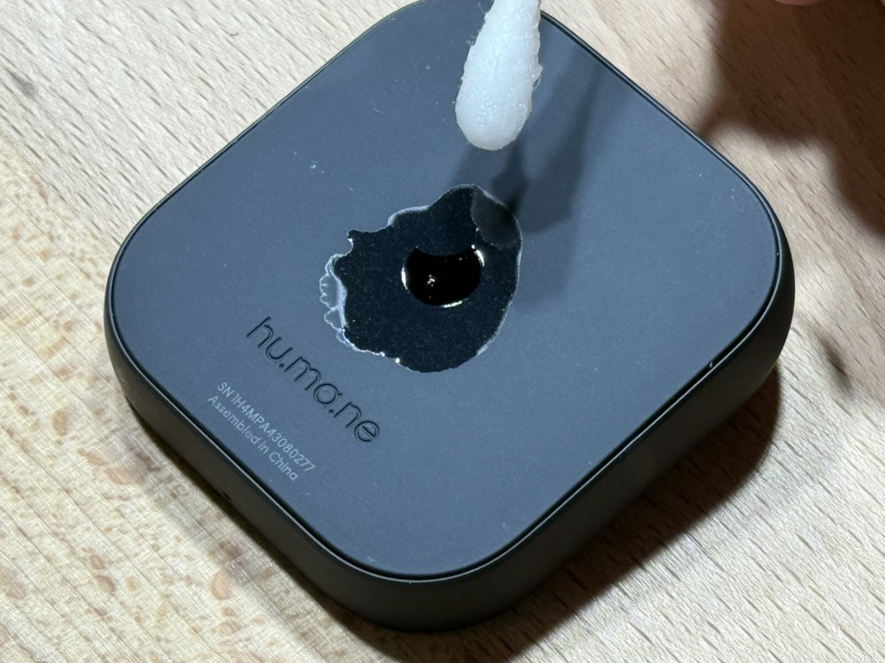

# Preparation

In order to be placed into an interposer and make contact with the connector, a tiny Humane moon sticker on the bottom of the Ai Pin needs to be removed. The sticker is somewhat thick and can be stuck on quite solidly, but once you manage to get something under it to pry it can come off quite easily.

1. Swap the sticker area in isopropyl alcohol, the purer the better. Let it soak and evaporate away. You may want to make multiple applications. The intention is to loosen the adhesive before you start to pry.

2. I recommend covering the area surrounding the moon in tape. This helps prevent you from maring the surface of the rubber on the back of the Pin.

1. Choose a very sharp object like a razor blade or a needle. Pick one of the points of the moon (small and has less adhesive) as a point to pry from. Very gently press the point of your tool into the edge of the sticker, with the intention of working your way underneath the sticker.

> [!CAUTION]
> Less than a millimeter beneath the sticker are the metal pads we need in order to connect to a computer. Take extreme care not to damage them.

4. Once you manage to get the sharp object to take hold in the sticker, it may take a surprising amount of force to actually remove the sticker. Go slow and apply more isopropyl if you feel it is necessary. You generally want to pry up from the surface, rather than try to drag the sharp object across the sticker.

5. Clean up the tape and any leftover adhesive. Do not use something abrasive (like metal) on the connector pads. You are now ready to place your Pin in an interposer.

